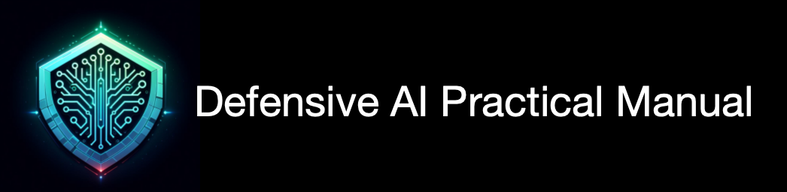

# Defensive-AI-Practical-Manual  
***************************************

***************************************
## Preface
In late 2022, OpenAI introduced a practical artificial intelligence technology called ChatGPT, which instantly took the internet by storm. The proliferation of AI models and applications has been rapid, signaling a new era for humanity—the age of AI.

AI is becoming increasingly powerful and convenient, assisting us in various aspects of life. It can now answer questions, create art, write code, place orders, and even drive. The scenarios once confined to science fiction are gradually becoming reality. However, alongside these advancements, there are also concerns.

The negative effects of AI adoption include rising unemployment rates due to human jobs being replaced by AI, legal and ethical challenges related to AI-generated content, and the fear that AI might escape human control and harm us.

This project was born out of a desire to address these issues. It is not about being overly pessimistic or adversarial toward AI. Instead, it aims to foster harmonious coexistence with AI. To defend against AI, a solid foundation of AI knowledge is essential. Consider this project a positive learning resource for an era where humans and AI coexist peacefully. Perhaps, if the day ever comes when AI truly goes rogue, this collection could serve as a guidebook—though we hope that day never arrives.

AI technology spans various domains, and its underlying principles are complex. My own knowledge is limited, so I welcome more friends to join me in building this project together.

## Project description
* This project primarily aims to explore defenses against AI. We will incorporate a wide range of ideas, articles, and projects, organizing them into categorized collections. We encourage diverse schools of thought, ensuring that the project remains impartial toward any particular ideology.
* All content within the project will be properly attributed, linking back to official sources. If there are objections to including specific content in the project, feel free to contact me.
* The project will follow a structured directory format, generating corresponding file structures. Note that this structure may evolve over time. 

## Table of Contents
### 1. AI
This section primarily collects content related to AI theory, models, and products.

#### 1.1 History
This subsection focuses on the historical development of AI.

#### 1.2 Theory
Here, we compile current mainstream and cutting-edge AI theories.

#### 1.3 Model
Explore publicly available mainstream AI models in this section.

#### 1.4 Product
Discover AI applications and products currently in use.

#### 1.5 Think_Discuss
Engage in discussions and reflections on various AI-related questions.

### 2. Defensive AI
In this section, we gather theories, models, and products related to defending against AI.

#### 2.1 Theory
Explore current mainstream and advanced theories for AI defense.

#### 2.2 Think_Discuss
Discuss and contemplate questions related to AI defense.